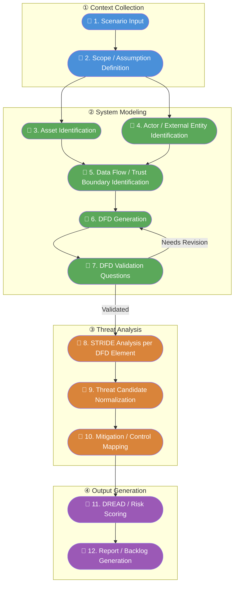

# threat-modeling-assistant-demo
Demo: LLM AI assistant for threat modeling

- LLM AI assistant for threat modeling using STRIDE and DREAD.

## Role Legend

| Symbol | Role | Description |
|---|---|---|
| 👤 **Human** | Human Required | 사람이 직접 수행하거나 최종 판단을 내려야 하는 단계 |
| 🤖 **LLM** | LLM Automated | LLM이 자동으로 처리하는 단계 |
| 🔁 **Human + LLM** | Human Review | LLM이 초안을 생성하고 사람이 검토·승인하는 단계 |

## Process Overview

| # | Step | Role | Notes |
|---|---|---|---|
| 1 | Scenario Input | 👤 **Human** | 분석할 시스템의 시나리오를 직접 작성하여 입력 |
| 2 | Scope / Assumption Definition | 🔁 **Human + LLM** | LLM이 시나리오에서 범위·가정 초안 추출 → 사람이 검토·보완 |
| 3 | Asset Identification | 🤖 **LLM** | LLM이 시나리오 기반으로 자산 목록 자동 식별 |
| 4 | Actor / External Entity Identification | 🤖 **LLM** | LLM이 외부 행위자 및 개체 자동 식별 |
| 5 | Data Flow / Trust Boundary Identification | 🤖 **LLM** | LLM이 데이터 흐름 및 신뢰 경계 자동 도출 |
| 6 | DFD Generation | 🤖 **LLM** | LLM이 데이터 흐름도(DFD) 자동 생성 |
| 7 | DFD Validation Questions | 🔁 **Human + LLM** | LLM이 검증 질문 생성 → **사람이 DFD 정확성을 검토하고 수정 여부 최종 결정** |
| 8 | STRIDE Analysis per DFD Element | 🤖 **LLM** | LLM이 DFD 각 요소에 대해 STRIDE 위협 자동 분석 |
| 9 | Threat Candidate Normalization | 🤖 **LLM** | LLM이 중복·유사 위협 후보를 정규화·통합 |
| 10 | Mitigation / Control Mapping | 🔁 **Human + LLM** | LLM이 완화 대책 초안 제시 → 사람이 실현 가능성 검토 |
| 11 | DREAD / Risk Scoring | 🔁 **Human + LLM** | LLM이 점수 초안 산정 → **사람이 비즈니스 맥락을 반영하여 최종 점수 확정** |
| 12 | Report / Backlog Generation | 🤖 **LLM** | LLM이 최종 보고서 및 백로그 자동 생성 |


## System architecture

### Input / Output
| Script | Input | Output |
|---|---|---|
| `01_context_collection.py` | Scenario (requires specified input file (e.g., `<scenario_name>.txt`) in folder `input/`) | `output/<scenario_name>/scope_and_assumptions.json` |
| `02_system_modeling.py` | `output/<scenario_name>/scope_and_assumptions.json` | `output/<scenario_name>/dfd.json`, `output/<scenario_name>/validation_questions.json` |
| `03_threat_analysis.py` | `output/<scenario_name>/dfd.json` | `output/<scenario_name>/threat_analysis.json` |
| `04_output_generation.py` | `output/<scenario_name>/threat_analysis.json` | `output/<scenario_name>/report.json` |


### Example scenario input
`input/scenario_example.txt`
```plaintext
- A web application that allows users to upload personal data.
- Users can create accounts and log in to manage their data.
- A database exists that stores user information and personal data.
- Authentication is handled based on username and password in database.
```

### Diagram of process flow



The overall flow is organized into 4 phases:

| Phase | Components | Human Touchpoints |
|---|---|---|
| **① Context Collection** | Scenario Input → Scope / Assumption Definition | 시나리오 작성(필수), 범위·가정 검토(권장) |
| **② System Modeling** | Asset & Actor Identification → Data Flow & Trust Boundary Identification → DFD Generation → Validation (feedback loop) | **DFD 검증 단계에서 반드시 사람이 정확성 판단** |
| **③ Threat Analysis** | STRIDE Analysis → Threat Candidate Normalization → Mitigation / Control Mapping | 완화 대책 실현 가능성 검토(권장) |
| **④ Output Generation** | DREAD / Risk Scoring → Report / Backlog Generation | **비즈니스 맥락 반영한 최종 리스크 점수 확정** |

The DFD Validation step (7) includes a feedback loop back to DFD Generation (6) when revisions are needed.

### 01_context_collection.py

### 02_system_modeling.py

### 03_threat_analysis.py

### 04_output_generation.py